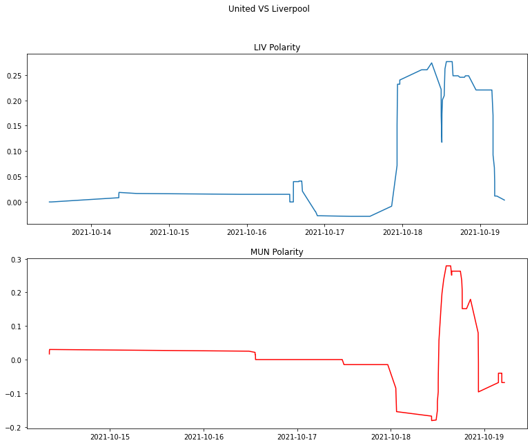

```python
# Import tweepy to work with the twitter API
import tweepy as tw

# Import numpy and pandas to work with dataframes
import numpy as np
import pandas as pd

# Import seaborn and matplotlib for viz
from matplotlib import pyplot as plt
```


```python
consumer_key = 'AUJgJP4AUOSQ2kxEn0fGJJVtQ'
consumer_secret = 'quLdAlGihzGRfI69eUztsEBdJg2pFl3OYM7xpsvQixEOamtSDh'
access_token = '2261179994-PCS6zNCGrnoz4qq3vcne4nU0gUNv3s8DgleeSfT'
access_token_secret = 'FnSB6L5IkTPrv24XbUhysSQCmPvHWoRZt7zTSBpA8ZweP'
```


```python
# Authenticate
auth = tw.OAuthHandler(consumer_key, consumer_secret)
# Set Tokens
auth.set_access_token(access_token, access_token_secret)
# Instantiate API
api = tw.API(auth, wait_on_rate_limit=True)
```


```python
hashtag = "#MUNLIV"
query = tw.Cursor(api.search_tweets, q=hashtag).items(1000)
tweets = [{'Tweet':tweet.text, 'Timestamp':tweet.created_at} for tweet in query]
print(tweets)
```

    [{'Tweet': 'Liverpool Manager Jurgen Klopp is hopeful that Defender Curtis Jones  will be fit enough to return to the squad to… https://t.co/TgdP8OMr59', 'Timestamp': datetime.datetime(2021, 10, 19, 7, 30, 54, tzinfo=datetime.timezone.utc)}, {'Tweet': 'RT @DrCrypto47: Man United v Liverpool SPECIAL!\n\n$200 $USDT #Giveaway! \n\nI will give away $200 if LIVERPOOL beat Man United next Sunday!\n\nT…', 'Timestamp': datetime.datetime(2021, 10, 19, 5, 10, 48, tzinfo=datetime.timezone.utc)}, {'Tweet': 'RT @MrSameer_: @Carra23 @GNev2 Don’t think on current form any of our United players will start in Liverpool team only outside chance to co…', 'Timestamp': datetime.datetime(2021, 10, 19, 4, 31, 2, tzinfo=datetime.timezone.utc)}, {'Tweet': 'RT @MrSameer_: @Carra23 @GNev2 Don’t think on current form any of our United players will start in Liverpool team only outside chance to co…', 'Timestamp': datetime.datetime(2021, 10, 19, 4, 30, 56, tzinfo=datetime.timezone.utc)}, {'Tweet': '@Carra23 @GNev2 Don’t think on current form any of our United players will start in Liverpool team only outside cha… https://t.co/KSOxdQT8ak', 'Timestamp': datetime.datetime(2021, 10, 19, 4, 25, 5, tzinfo=datetime.timezone.utc)}, {'Tweet': 'RT @zubinofficial: Maguire, really @GNev2??! He barely gets into #LFC’s u-23s! #MUNLIV #MUFC 🙈 https://t.co/DqAI0fOXJX', 'Timestamp': datetime.datetime(2021, 10, 19, 4, 1, 8, tzinfo=datetime.timezone.utc)}, {'Tweet': 'RT @thecursedknight: Absurd even as a Liverpool fan, all bias aside\n\nBruno in for Firmino\nPogba in for Henderson\nMatip in for Maguire.\n\nSo…', 'Timestamp': datetime.datetime(2021, 10, 19, 4, 0, 25, tzinfo=datetime.timezone.utc)}, {'Tweet': 'Absurd even as a Liverpool fan, all bias aside\n\nBruno in for Firmino\nPogba in for Henderson\nMatip in for Maguire.… https://t.co/F6A952K0dK', 'Timestamp': datetime.datetime(2021, 10, 19, 4, 0, 20, tzinfo=datetime.timezone.utc)}, {'Tweet': 'RT @zubinofficial: Maguire, really @GNev2??! He barely gets into #LFC’s u-23s! #MUNLIV #MUFC 🙈 https://t.co/DqAI0fOXJX', 'Timestamp': datetime.datetime(2021, 10, 19, 3, 53, 41, tzinfo=datetime.timezone.utc)}, {'Tweet': 'Maguire, really @GNev2??! He barely gets into #LFC’s u-23s! #MUNLIV #MUFC 🙈 https://t.co/DqAI0fOXJX', 'Timestamp': datetime.datetime(2021, 10, 19, 3, 53, 35, tzinfo=datetime.timezone.utc)}, {'Tweet': 'RT @thecursedknight: #lfc #fsgout #Atmliv #munliv\nNext two ties are as as mouth watering as it can get.\n\nIf we can 4 points, we have done v…', 'Timestamp': datetime.datetime(2021, 10, 19, 3, 45, 42, tzinfo=datetime.timezone.utc)}, {'Tweet': 'RT @thecursedknight: #lfc #fsgout #Atmliv #munliv\nNext two ties are as as mouth watering as it can get.\n\nIf we can 4 points, we have done v…', 'Timestamp': datetime.datetime(2021, 10, 19, 3, 40, 48, tzinfo=datetime.timezone.utc)}, {'Tweet': '#lfc #fsgout #Atmliv #munliv\nNext two ties are as as mouth watering as it can get.\n\nIf we can 4 points, we have don… https://t.co/Bffqmpf4Xq', 'Timestamp': datetime.datetime(2021, 10, 19, 3, 40, 42, tzinfo=datetime.timezone.utc)}, {'Tweet': 'RT @DrCrypto47: Man United v Liverpool SPECIAL!\n\n$200 $USDT #Giveaway! \n\nI will give away $200 if LIVERPOOL beat Man United next Sunday!\n\nT…', 'Timestamp': datetime.datetime(2021, 10, 19, 3, 38, 59, tzinfo=datetime.timezone.utc)}, {'Tweet': 'RT @DrCrypto47: Man United v Liverpool SPECIAL!\n\n$200 $USDT #Giveaway! \n\nI will give away $200 if LIVERPOOL beat Man United next Sunday!\n\nT…', 'Timestamp': datetime.datetime(2021, 10, 19, 3, 38, 54, tzinfo=datetime.timezone.utc)}, {'Tweet': 'RT @MattiasArvidss1: good morning ladies and gentlemen. Wish you a fab day. A huge week ahead and the lads are back in the #ChampionsLeague…', 'Timestamp': datetime.datetime(2021, 10, 19, 0, 57, 44, tzinfo=datetime.timezone.utc)}, {'Tweet': 'RT @MattiasArvidss1: good morning ladies and gentlemen. Wish you a fab day. A huge week ahead and the lads are back in the #ChampionsLeague…', 'Timestamp': datetime.datetime(2021, 10, 19, 0, 52, 40, tzinfo=datetime.timezone.utc)}, {'Tweet': 'RT @MattiasArvidss1: good morning ladies and gentlemen. Wish you a fab day. A huge week ahead and the lads are back in the #ChampionsLeague…', 'Timestamp': datetime.datetime(2021, 10, 19, 0, 41, 30, tzinfo=datetime.timezone.utc)}, {'Tweet': 'RT @MattiasArvidss1: good morning ladies and gentlemen. Wish you a fab day. A huge week ahead and the lads are back in the #ChampionsLeague…', 'Timestamp': datetime.datetime(2021, 10, 19, 0, 41, 24, tzinfo=datetime.timezone.utc)}, {'Tweet': '@SkySportsNews @Carra23 @GNev2 4-2-3-1\n\nAllison\nTrent \nMatip\nVirgil\nRobertson\nHenderson\nFabinho\nSalah\nBruno\nMane \nM… https://t.co/1bQnDL4ESK', 'Timestamp': datetime.datetime(2021, 10, 19, 0, 26, 55, tzinfo=datetime.timezone.utc)}, {'Tweet': 'a defeat to #Liverpool could potentially see off the second #ManUtd manager in a row 👀\n\n#solskjaer #Mourinho #MUNLIV', 'Timestamp': datetime.datetime(2021, 10, 18, 22, 44, 45, tzinfo=datetime.timezone.utc)}, {'Tweet': 'RT @JohnKellyIrl: @Ayorbami @Vaughnf17 @UnitedPeoplesTV Are you crazy; @B_Fernandes8 wouldnt get into #LFC ladies team.  Jaysus Sam your kn…', 'Timestamp': datetime.datetime(2021, 10, 18, 22, 31, 2, tzinfo=datetime.timezone.utc)}, {'Tweet': 'RT @JohnKellyIrl: @Ayorbami @Vaughnf17 @UnitedPeoplesTV Are you crazy; @B_Fernandes8 wouldnt get into #LFC ladies team.  Jaysus Sam your kn…', 'Timestamp': datetime.datetime(2021, 10, 18, 22, 30, 56, tzinfo=datetime.timezone.utc)}, {'Tweet': '@Ayorbami @Vaughnf17 @UnitedPeoplesTV Are you crazy; @B_Fernandes8 wouldnt get into #LFC ladies team.  Jaysus Sam y… https://t.co/meOBwlO6vW', 'Timestamp': datetime.datetime(2021, 10, 18, 22, 27, 6, tzinfo=datetime.timezone.utc)}, {'Tweet': '@SkySportsNews @GNev2 @Carra23 Gary said it, the attacking players need to be better and more efficient.\nBut there… https://t.co/Dn8IsjUMb4', 'Timestamp': datetime.datetime(2021, 10, 18, 22, 20, 58, tzinfo=datetime.timezone.utc)}, {'Tweet': 'RT @Kulz83: They went Matip and Maguire over Varane - these fucking retards #MondayNightFootball #MNF #MUNLIV #MUFC #PremierLeague Maguire…', 'Timestamp': datetime.datetime(2021, 10, 18, 22, 1, 1, tzinfo=datetime.timezone.utc)}, {'Tweet': 'They went Matip and Maguire over Varane - these fucking retards #MondayNightFootball #MNF #MUNLIV #MUFC… https://t.co/FiP7wtGfIe', 'Timestamp': datetime.datetime(2021, 10, 18, 22, 0, 39, tzinfo=datetime.timezone.utc)}, {'Tweet': 'RT @KC_Pawsy: And we are about to see it @Carra23 @GNev2 #MNF #MUNLIV https://t.co/5F5U2c6IJo', 'Timestamp': datetime.datetime(2021, 10, 18, 21, 40, 19, tzinfo=datetime.timezone.utc)}, {'Tweet': 'And we are about to see it @Carra23 @GNev2 #MNF #MUNLIV https://t.co/5F5U2c6IJo', 'Timestamp': datetime.datetime(2021, 10, 18, 21, 40, 13, tzinfo=datetime.timezone.utc)}, {'Tweet': 'Codzienna przypominajka tej rywalizacjii. Dzisiaj mecz z sezonu 2017/18, defensywny styl Mourinho, brzydka gra ale… https://t.co/obojQImhun', 'Timestamp': datetime.datetime(2021, 10, 18, 21, 12, 28, tzinfo=datetime.timezone.utc)}, {'Tweet': '😍😍😍🇾🇪 TAK W NIEDZIELE MA BYĆ!!!!!\n#MUNLIV #jejwysokość #PremierLeague #PremierLeagueNaESPN #plkpl #FootballFocus https://t.co/OjyF3hiqKJ', 'Timestamp': datetime.datetime(2021, 10, 18, 21, 0, 53, tzinfo=datetime.timezone.utc)}, {'Tweet': 'More excited to go to #MUNATA and #MUNLIV than I have been for ages. Whichever way it goes, we will be witnessing s… https://t.co/MoYdiZoqDP', 'Timestamp': datetime.datetime(2021, 10, 18, 20, 40, 53, tzinfo=datetime.timezone.utc)}, {'Tweet': 'RT @DrCrypto47: Man United v Liverpool SPECIAL!\n\n$200 $USDT #Giveaway! \n\nI will give away $200 if LIVERPOOL beat Man United next Sunday!\n\nT…', 'Timestamp': datetime.datetime(2021, 10, 18, 20, 28, 45, tzinfo=datetime.timezone.utc)}, {'Tweet': 'RT @DrCrypto47: Man United v Liverpool SPECIAL!\n\n$200 $USDT #Giveaway! \n\nI will give away $200 if LIVERPOOL beat Man United next Sunday!\n\nT…', 'Timestamp': datetime.datetime(2021, 10, 18, 19, 28, 38, tzinfo=datetime.timezone.utc)}, {'Tweet': 'RT @DrCrypto47: Man United v Liverpool SPECIAL!\n\n$200 $USDT #Giveaway! \n\nI will give away $200 if LIVERPOOL beat Man United next Sunday!\n\nT…', 'Timestamp': datetime.datetime(2021, 10, 18, 19, 11, 30, tzinfo=datetime.timezone.utc)}, {'Tweet': "RT @InfogolApp: 🧐 A huge game at Old Trafford.\n\n• Ole Gunnar Solskjaer could do with a win to ease external pressure\n• Jurgen Klopp's #LFC…", 'Timestamp': datetime.datetime(2021, 10, 18, 18, 43, 2, tzinfo=datetime.timezone.utc)}, {'Tweet': 'RT @kieron_ks1tv: WOW! 😳\n\nDID YOU SAY TWO FORMER PREMIER LEAGUE FORWARDS, FOR ONE OF THE BIGGEST GAMES OF THE SEASON?\n\nWELL KS1 TV &amp; .@ManU…', 'Timestamp': datetime.datetime(2021, 10, 18, 18, 34, 11, tzinfo=datetime.timezone.utc)}, {'Tweet': 'WOW! 😳\n\nDID YOU SAY TWO FORMER PREMIER LEAGUE FORWARDS, FOR ONE OF THE BIGGEST GAMES OF THE SEASON?\n\nWELL KS1 TV &amp;… https://t.co/QT5ICyRYuh', 'Timestamp': datetime.datetime(2021, 10, 18, 18, 34, 5, tzinfo=datetime.timezone.utc)}, {'Tweet': 'RT @ManUnited_Show: In our biggest episode yet, Premier League &amp; England legend @EmileHeskeyUK is joining regular hosts @NathanEllington an…', 'Timestamp': datetime.datetime(2021, 10, 18, 18, 22, 1, tzinfo=datetime.timezone.utc)}, {'Tweet': 'RT @ManUnited_Show: In our biggest episode yet, Premier League &amp; England legend @EmileHeskeyUK is joining regular hosts @NathanEllington an…', 'Timestamp': datetime.datetime(2021, 10, 18, 18, 21, 38, tzinfo=datetime.timezone.utc)}, {'Tweet': 'RT @ManUnited_Show: In our biggest episode yet, Premier League &amp; England legend @EmileHeskeyUK is joining regular hosts @NathanEllington an…', 'Timestamp': datetime.datetime(2021, 10, 18, 18, 20, 55, tzinfo=datetime.timezone.utc)}, {'Tweet': 'RT @ManUnited_Show: In our biggest episode yet, Premier League &amp; England legend @EmileHeskeyUK is joining regular hosts @NathanEllington an…', 'Timestamp': datetime.datetime(2021, 10, 18, 18, 14, 9, tzinfo=datetime.timezone.utc)}, {'Tweet': 'In our biggest episode yet, Premier League &amp; England legend @EmileHeskeyUK is joining regular hosts… https://t.co/KNJnbykPjl', 'Timestamp': datetime.datetime(2021, 10, 18, 18, 13, 28, tzinfo=datetime.timezone.utc)}, {'Tweet': 'RT @DrCrypto47: Man United v Liverpool SPECIAL!\n\n$200 $USDT #Giveaway! \n\nI will give away $200 if LIVERPOOL beat Man United next Sunday!\n\nT…', 'Timestamp': datetime.datetime(2021, 10, 18, 17, 53, 36, tzinfo=datetime.timezone.utc)}, {'Tweet': 'RT @MattiasArvidss1: good morning ladies and gentlemen. Wish you a fab day. A huge week ahead and the lads are back in the #ChampionsLeague…', 'Timestamp': datetime.datetime(2021, 10, 18, 17, 48, 16, tzinfo=datetime.timezone.utc)}, {'Tweet': 'RT @WorldSportsBet: Man Utd vs Liverpool #PL #MUNLIV\n\nBack any player to score first and get your winnings doubled if he scores again, PLUS…', 'Timestamp': datetime.datetime(2021, 10, 18, 17, 45, 33, tzinfo=datetime.timezone.utc)}, {'Tweet': 'RT @MattiasArvidss1: good morning ladies and gentlemen. Wish you a fab day. A huge week ahead and the lads are back in the #ChampionsLeague…', 'Timestamp': datetime.datetime(2021, 10, 18, 17, 39, 25, tzinfo=datetime.timezone.utc)}, {'Tweet': 'RT @MattiasArvidss1: good morning ladies and gentlemen. Wish you a fab day. A huge week ahead and the lads are back in the #ChampionsLeague…', 'Timestamp': datetime.datetime(2021, 10, 18, 17, 33, 33, tzinfo=datetime.timezone.utc)}, {'Tweet': '@MoSalah\n@Carra23 \n#kingmo #ynwa #salah #MUNLIV https://t.co/GwzfwCBrRa', 'Timestamp': datetime.datetime(2021, 10, 18, 17, 23, 17, tzinfo=datetime.timezone.utc)}, {'Tweet': 'RT @DrCrypto47: Man United v Liverpool SPECIAL!\n\n$200 $USDT #Giveaway! \n\nI will give away $200 if LIVERPOOL beat Man United next Sunday!\n\nT…', 'Timestamp': datetime.datetime(2021, 10, 18, 17, 13, 41, tzinfo=datetime.timezone.utc)}, {'Tweet': 'RT @MattiasArvidss1: good morning ladies and gentlemen. Wish you a fab day. A huge week ahead and the lads are back in the #ChampionsLeague…', 'Timestamp': datetime.datetime(2021, 10, 18, 16, 38, 17, tzinfo=datetime.timezone.utc)}, {'Tweet': "RT @InfogolApp: 🧐 A huge game at Old Trafford.\n\n• Ole Gunnar Solskjaer could do with a win to ease external pressure\n• Jurgen Klopp's #LFC…", 'Timestamp': datetime.datetime(2021, 10, 18, 16, 35, 5, tzinfo=datetime.timezone.utc)}, {'Tweet': '🧐 A huge game at Old Trafford.\n\n• Ole Gunnar Solskjaer could do with a win to ease external pressure\n• Jurgen Klopp… https://t.co/umB3POZchF', 'Timestamp': datetime.datetime(2021, 10, 18, 16, 35, tzinfo=datetime.timezone.utc)}, {'Tweet': 'RT @KC_Pawsy: I wonder what @GNev2’s #MUFC &amp; #LFC combined 11 would be now? @Carra23 #MNF #MUNLIV https://t.co/fhGoBvKPbN', 'Timestamp': datetime.datetime(2021, 10, 18, 16, 22, 5, tzinfo=datetime.timezone.utc)}, {'Tweet': 'I wonder what @GNev2’s #MUFC &amp; #LFC combined 11 would be now? @Carra23 #MNF #MUNLIV https://t.co/fhGoBvKPbN', 'Timestamp': datetime.datetime(2021, 10, 18, 16, 22, tzinfo=datetime.timezone.utc)}, {'Tweet': "RT @MattiasArvidss1: thank you for taking me to 9,2k. 800 to go for Tuesday or Sunday. I'll have something extra special for you if I make…", 'Timestamp': datetime.datetime(2021, 10, 18, 16, 21, 21, tzinfo=datetime.timezone.utc)}, {'Tweet': '🇾🇪🇾🇪 MAN UTD VS LIVERPOOL AVAILABLE DM 🇾🇪🇾🇪 #VIVARONALDO #Ronaldo #ManchesterUnited #MUNLIV', 'Timestamp': datetime.datetime(2021, 10, 18, 15, 40, 38, tzinfo=datetime.timezone.utc)}, {'Tweet': 'Man United fans want Liverpool to beat United so they can get rid of Ole. \n😂\n#MUNLIV', 'Timestamp': datetime.datetime(2021, 10, 18, 15, 38, 55, tzinfo=datetime.timezone.utc)}, {'Tweet': 'RT @DrCrypto47: Man United v Liverpool SPECIAL!\n\n$200 $USDT #Giveaway! \n\nI will give away $200 if LIVERPOOL beat Man United next Sunday!\n\nT…', 'Timestamp': datetime.datetime(2021, 10, 18, 15, 23, 43, tzinfo=datetime.timezone.utc)}, {'Tweet': 'While #oleout have gathered outside Old Trafford protesting against signing Varane , Ronaldo and Sancho here is a f… https://t.co/XL4kFN8xJ8', 'Timestamp': datetime.datetime(2021, 10, 18, 14, 54, 41, tzinfo=datetime.timezone.utc)}, {'Tweet': 'RT @DrCrypto47: Man United v Liverpool SPECIAL!\n\n$200 $USDT #Giveaway! \n\nI will give away $200 if LIVERPOOL beat Man United next Sunday!\n\nT…', 'Timestamp': datetime.datetime(2021, 10, 18, 14, 15, 31, tzinfo=datetime.timezone.utc)}, {'Tweet': 'RT @MattiasArvidss1: good morning ladies and gentlemen. Wish you a fab day. A huge week ahead and the lads are back in the #ChampionsLeague…', 'Timestamp': datetime.datetime(2021, 10, 18, 14, 0, 48, tzinfo=datetime.timezone.utc)}, {'Tweet': 'RT @MattiasArvidss1: good morning ladies and gentlemen. Wish you a fab day. A huge week ahead and the lads are back in the #ChampionsLeague…', 'Timestamp': datetime.datetime(2021, 10, 18, 13, 48, 58, tzinfo=datetime.timezone.utc)}, {'Tweet': 'RT @DrCrypto47: Man United v Liverpool SPECIAL!\n\n$200 $USDT #Giveaway! \n\nI will give away $200 if LIVERPOOL beat Man United next Sunday!\n\nT…', 'Timestamp': datetime.datetime(2021, 10, 18, 13, 36, 3, tzinfo=datetime.timezone.utc)}, {'Tweet': 'RT @DrCrypto47: Man United v Liverpool SPECIAL!\n\n$200 $USDT #Giveaway! \n\nI will give away $200 if LIVERPOOL beat Man United next Sunday!\n\nT…', 'Timestamp': datetime.datetime(2021, 10, 18, 13, 9, 53, tzinfo=datetime.timezone.utc)}, {'Tweet': "RT @MattiasArvidss1: thank you for taking me to 9,2k. 800 to go for Tuesday or Sunday. I'll have something extra special for you if I make…", 'Timestamp': datetime.datetime(2021, 10, 18, 13, 2, 4, tzinfo=datetime.timezone.utc)}, {'Tweet': 'Man Utd vs Liverpool #PL #MUNLIV\n\nBack any player to score first and get your winnings doubled if he scores again,… https://t.co/L4Qt0Yf6yF', 'Timestamp': datetime.datetime(2021, 10, 18, 13, 1, 57, tzinfo=datetime.timezone.utc)}, {'Tweet': 'RT @DrCrypto47: Man United v Liverpool SPECIAL!\n\n$200 $USDT #Giveaway! \n\nI will give away $200 if LIVERPOOL beat Man United next Sunday!\n\nT…', 'Timestamp': datetime.datetime(2021, 10, 18, 12, 55, 22, tzinfo=datetime.timezone.utc)}, {'Tweet': "RT @tfdo_: #SuperSunday Doesn't get bigger than this!\n\nThe Football Dug Out &amp; The Cricket Dug Out presents Parallel Screenings of the Manch…", 'Timestamp': datetime.datetime(2021, 10, 18, 12, 38, 11, tzinfo=datetime.timezone.utc)}, {'Tweet': 'RT @MattiasArvidss1: good morning ladies and gentlemen. Wish you a fab day. A huge week ahead and the lads are back in the #ChampionsLeague…', 'Timestamp': datetime.datetime(2021, 10, 18, 12, 36, 41, tzinfo=datetime.timezone.utc)}, {'Tweet': 'RT @DrCrypto47: Man United v Liverpool SPECIAL!\n\n$200 $USDT #Giveaway! \n\nI will give away $200 if LIVERPOOL beat Man United next Sunday!\n\nT…', 'Timestamp': datetime.datetime(2021, 10, 18, 12, 23, 45, tzinfo=datetime.timezone.utc)}, {'Tweet': "RT @MattiasArvidss1: thank you for taking me to 9,2k. 800 to go for Tuesday or Sunday. I'll have something extra special for you if I make…", 'Timestamp': datetime.datetime(2021, 10, 18, 12, 22, 16, tzinfo=datetime.timezone.utc)}, {'Tweet': "RT @MattiasArvidss1: thank you for taking me to 9,2k. 800 to go for Tuesday or Sunday. I'll have something extra special for you if I make…", 'Timestamp': datetime.datetime(2021, 10, 18, 12, 22, 11, tzinfo=datetime.timezone.utc)}, {'Tweet': 'RT @DrCrypto47: Man United v Liverpool SPECIAL!\n\n$200 $USDT #Giveaway! \n\nI will give away $200 if LIVERPOOL beat Man United next Sunday!\n\nT…', 'Timestamp': datetime.datetime(2021, 10, 18, 12, 14, 1, tzinfo=datetime.timezone.utc)}, {'Tweet': 'RT @DrCrypto47: Man United v Liverpool SPECIAL!\n\n$200 $USDT #Giveaway! \n\nI will give away $200 if LIVERPOOL beat Man United next Sunday!\n\nT…', 'Timestamp': datetime.datetime(2021, 10, 18, 12, 12, 26, tzinfo=datetime.timezone.utc)}, {'Tweet': 'RT @DrCrypto47: Man United v Liverpool SPECIAL!\n\n$200 $USDT #Giveaway! \n\nI will give away $200 if LIVERPOOL beat Man United next Sunday!\n\nT…', 'Timestamp': datetime.datetime(2021, 10, 18, 12, 12, 21, tzinfo=datetime.timezone.utc)}, {'Tweet': 'RT @MattiasArvidss1: good morning ladies and gentlemen. Wish you a fab day. A huge week ahead and the lads are back in the #ChampionsLeague…', 'Timestamp': datetime.datetime(2021, 10, 18, 12, 12, 1, tzinfo=datetime.timezone.utc)}, {'Tweet': "RT @MattiasArvidss1: thank you for taking me to 9,2k. 800 to go for Tuesday or Sunday. I'll have something extra special for you if I make…", 'Timestamp': datetime.datetime(2021, 10, 18, 12, 10, 43, tzinfo=datetime.timezone.utc)}, {'Tweet': 'RT @MattiasArvidss1: good morning ladies and gentlemen. Wish you a fab day. A huge week ahead and the lads are back in the #ChampionsLeague…', 'Timestamp': datetime.datetime(2021, 10, 18, 12, 8, 12, tzinfo=datetime.timezone.utc)}, {'Tweet': "thank you for taking me to 9,2k. 800 to go for Tuesday or Sunday. I'll have something extra special for you if I ma… https://t.co/BzipFux2Xr", 'Timestamp': datetime.datetime(2021, 10, 18, 12, 2, 16, tzinfo=datetime.timezone.utc)}, {'Tweet': 'RT @DrCrypto47: Man United v Liverpool SPECIAL!\n\n$200 $USDT #Giveaway! \n\nI will give away $200 if LIVERPOOL beat Man United next Sunday!\n\nT…', 'Timestamp': datetime.datetime(2021, 10, 18, 11, 59, 53, tzinfo=datetime.timezone.utc)}, {'Tweet': 'Man United v Liverpool SPECIAL!\n\n$200 $USDT #Giveaway! \n\nI will give away $200 if LIVERPOOL beat Man United next Su… https://t.co/cJSgZLeENM', 'Timestamp': datetime.datetime(2021, 10, 18, 11, 59, tzinfo=datetime.timezone.utc)}, {'Tweet': 'RT @MattiasArvidss1: good morning ladies and gentlemen. Wish you a fab day. A huge week ahead and the lads are back in the #ChampionsLeague…', 'Timestamp': datetime.datetime(2021, 10, 18, 11, 51, 2, tzinfo=datetime.timezone.utc)}, {'Tweet': 'RT @MattiasArvidss1: good morning ladies and gentlemen. Wish you a fab day. A huge week ahead and the lads are back in the #ChampionsLeague…', 'Timestamp': datetime.datetime(2021, 10, 18, 11, 46, 30, tzinfo=datetime.timezone.utc)}, {'Tweet': 'RT @MattiasArvidss1: for me if there are fan protests ahead of Sundays #MUNLIV game that are similar to those last season #ManchesterUnited…', 'Timestamp': datetime.datetime(2021, 10, 18, 11, 40, 10, tzinfo=datetime.timezone.utc)}, {'Tweet': 'RT @MattiasArvidss1: good morning ladies and gentlemen. Wish you a fab day. A huge week ahead and the lads are back in the #ChampionsLeague…', 'Timestamp': datetime.datetime(2021, 10, 18, 11, 30, 9, tzinfo=datetime.timezone.utc)}, {'Tweet': "RT @weddie_s: Jurgen Klopp's side travel to Old Trafford next Sunday and they'll want to maintain their unbeaten start to the season...  #L…", 'Timestamp': datetime.datetime(2021, 10, 18, 10, 45, 41, tzinfo=datetime.timezone.utc)}, {'Tweet': "Jurgen Klopp's side travel to Old Trafford next Sunday and they'll want to maintain their unbeaten start to the sea… https://t.co/5D41g2rpwd", 'Timestamp': datetime.datetime(2021, 10, 18, 10, 45, 2, tzinfo=datetime.timezone.utc)}, {'Tweet': "#SuperSunday Doesn't get bigger than this!\n\nThe Football Dug Out &amp; The Cricket Dug Out presents Parallel Screenings… https://t.co/f0RVGIL5Cv", 'Timestamp': datetime.datetime(2021, 10, 18, 10, 35, 46, tzinfo=datetime.timezone.utc)}, {'Tweet': 'RT @MattiasArvidss1: for me if there are fan protests ahead of Sundays #MUNLIV game that are similar to those last season #ManchesterUnited…', 'Timestamp': datetime.datetime(2021, 10, 18, 10, 30, 58, tzinfo=datetime.timezone.utc)}, {'Tweet': 'RT @MattiasArvidss1: for me if there are fan protests ahead of Sundays #MUNLIV game that are similar to those last season #ManchesterUnited…', 'Timestamp': datetime.datetime(2021, 10, 18, 10, 29, 34, tzinfo=datetime.timezone.utc)}, {'Tweet': 'for me if there are fan protests ahead of Sundays #MUNLIV game that are similar to those last season… https://t.co/1UhgK9EXZ3', 'Timestamp': datetime.datetime(2021, 10, 18, 10, 29, 29, tzinfo=datetime.timezone.utc)}, {'Tweet': 'RT @MattiasArvidss1: good morning ladies and gentlemen. Wish you a fab day. A huge week ahead and the lads are back in the #ChampionsLeague…', 'Timestamp': datetime.datetime(2021, 10, 18, 10, 23, 31, tzinfo=datetime.timezone.utc)}, {'Tweet': 'good morning ladies and gentlemen. Wish you a fab day. A huge week ahead and the lads are back in the… https://t.co/XZaxUOD1ML', 'Timestamp': datetime.datetime(2021, 10, 18, 10, 23, 25, tzinfo=datetime.timezone.utc)}, {'Tweet': 'If Utd put out the same 11 as against Liverpool at the weekend they’ll get ripped a new one!OGS will be having rest… https://t.co/JjxHJWG9db', 'Timestamp': datetime.datetime(2021, 10, 18, 9, 3, 16, tzinfo=datetime.timezone.utc)}, {'Tweet': 'RT @davesLFCchats: I’m Live tonight reds at 7:30 pm 🔥🚨 \nA huge week coming up ATLETICO &amp; Man Utd 👊🏻 and we have this man on fire 🔥 #Mosalah…', 'Timestamp': datetime.datetime(2021, 10, 18, 8, 17, 17, tzinfo=datetime.timezone.utc)}, {'Tweet': '@TerryLyons_ I am selling my tickets to the match vs Liverpool #muntickets #MUNFC #MUNTICKETS #manunitedtickets… https://t.co/iqXw6hVrYW', 'Timestamp': datetime.datetime(2021, 10, 18, 7, 38, 16, tzinfo=datetime.timezone.utc)}, {'Tweet': '@SkySportsPL I am selling my tickets to the match vs Liverpool #muntickets #MUNFC #MUNTICKETS #manunitedtickets… https://t.co/yJGLk0Q3cS', 'Timestamp': datetime.datetime(2021, 10, 18, 7, 36, 7, tzinfo=datetime.timezone.utc)}, {'Tweet': "RT @MattiasArvidss1: I'm 810 away from 10k followers. Tuesday may well be steep, but we have a hugely massive game on Sunday. I'd love 10k…", 'Timestamp': datetime.datetime(2021, 10, 18, 7, 6, 7, tzinfo=datetime.timezone.utc)}, {'Tweet': 'I’m Live tonight reds at 7:30 pm 🔥🚨 \nA huge week coming up ATLETICO &amp; Man Utd 👊🏻 and we have this man on fire 🔥… https://t.co/7ZY7K4elTD', 'Timestamp': datetime.datetime(2021, 10, 18, 6, 41, 3, tzinfo=datetime.timezone.utc)}, {'Tweet': 'No rest this Sunday #INDPAK #MUNLIV #ElClassico #USGP #SuperSunday https://t.co/aEgpw8pQOq', 'Timestamp': datetime.datetime(2021, 10, 18, 6, 18, 9, tzinfo=datetime.timezone.utc)}, {'Tweet': 'Manu vs Liverpool\nMilan vs Juventus \nPSG vs Marseille\n\nPakistan vs India \n\nReal Madrid vs Barca\n\nWhat a day man, 24… https://t.co/P7xK9XZLfw', 'Timestamp': datetime.datetime(2021, 10, 18, 5, 56, 3, tzinfo=datetime.timezone.utc)}, {'Tweet': '@FCBarcelona @aguerosergiokun Enough of that, were moving on to non City rivalry Derby day,\nSunday 24th October… https://t.co/JQqRBt67yB', 'Timestamp': datetime.datetime(2021, 10, 18, 5, 42, 41, tzinfo=datetime.timezone.utc)}, {'Tweet': 'Next Sunday. 🤩 \nFrom 19:45 to 21:00, i will watch Barca vs RM and from 21:00 onwards i will switch to #MUNLIV . Pre… https://t.co/tUm39h5zsb', 'Timestamp': datetime.datetime(2021, 10, 18, 4, 46, 1, tzinfo=datetime.timezone.utc)}, {'Tweet': '#MUNLIV', 'Timestamp': datetime.datetime(2021, 10, 18, 4, 3, 32, tzinfo=datetime.timezone.utc)}, {'Tweet': "Less Than A Week Left Until England's Biggest Game ⏳🔴\n\nAnother David De Gea masterclass will be desperately needed… https://t.co/q9BWGh37Pc", 'Timestamp': datetime.datetime(2021, 10, 18, 3, 53, 31, tzinfo=datetime.timezone.utc)}, {'Tweet': 'Eduardo Mendy has become a wall of China for the Chelsea backline #EPL #MUNLIV #LIVMUN #MUNCHE #CHEMUN https://t.co/5Xo8A5KAoN', 'Timestamp': datetime.datetime(2021, 10, 18, 2, 4, 53, tzinfo=datetime.timezone.utc)}, {'Tweet': 'RT @MyriagonMind: Will Ronaldo prove to be a bad signing for Man Utd?\n\n#ManUnited #RetweeetPlease #Mufc #RETWEEET #OleOutNow #MOTD2 #bbcfoo…', 'Timestamp': datetime.datetime(2021, 10, 18, 1, 30, 57, tzinfo=datetime.timezone.utc)}, {'Tweet': 'Will Ronaldo prove to be a bad signing for Man Utd?\n\n#ManUnited #RetweeetPlease #Mufc #RETWEEET #OleOutNow #MOTD2… https://t.co/68UXpf87kf', 'Timestamp': datetime.datetime(2021, 10, 18, 1, 19, 48, tzinfo=datetime.timezone.utc)}, {'Tweet': 'Ticket available for Manchester utd vs liverpool game\n#mufcticket\n#MUFCvLCFC\n#MUNLIV\n#OleOutNow #OleOutTonight… https://t.co/kAqBWwxKSJ', 'Timestamp': datetime.datetime(2021, 10, 17, 23, 34, 1, tzinfo=datetime.timezone.utc)}, {'Tweet': "RT @MattiasArvidss1: I'm 810 away from 10k followers. Tuesday may well be steep, but we have a hugely massive game on Sunday. I'd love 10k…", 'Timestamp': datetime.datetime(2021, 10, 17, 23, 31, 12, tzinfo=datetime.timezone.utc)}, {'Tweet': "RT @MattiasArvidss1: I'm 810 away from 10k followers. Tuesday may well be steep, but we have a hugely massive game on Sunday. I'd love 10k…", 'Timestamp': datetime.datetime(2021, 10, 17, 23, 18, 24, tzinfo=datetime.timezone.utc)}, {'Tweet': "RT @MattiasArvidss1: they should start next season at -20 but it won't happen as it is #ManchesterUnited #LFC #WeAreLiverpool #ThisMeansMor…", 'Timestamp': datetime.datetime(2021, 10, 17, 23, 15, 40, tzinfo=datetime.timezone.utc)}, {'Tweet': "RT @MattiasArvidss1: they should start next season at -20 but it won't happen as it is #ManchesterUnited #LFC #WeAreLiverpool #ThisMeansMor…", 'Timestamp': datetime.datetime(2021, 10, 17, 23, 13, 2, tzinfo=datetime.timezone.utc)}, {'Tweet': "they should start next season at -20 but it won't happen as it is #ManchesterUnited #LFC #WeAreLiverpool… https://t.co/2xYNetNkho", 'Timestamp': datetime.datetime(2021, 10, 17, 23, 12, 57, tzinfo=datetime.timezone.utc)}, {'Tweet': "RT @MattiasArvidss1: I'm 810 away from 10k followers. Tuesday may well be steep, but we have a hugely massive game on Sunday. I'd love 10k…", 'Timestamp': datetime.datetime(2021, 10, 17, 22, 50, 24, tzinfo=datetime.timezone.utc)}, {'Tweet': "RT @MattiasArvidss1: I'm 810 away from 10k followers. Tuesday may well be steep, but we have a hugely massive game on Sunday. I'd love 10k…", 'Timestamp': datetime.datetime(2021, 10, 17, 22, 47, 9, tzinfo=datetime.timezone.utc)}, {'Tweet': "RT @MattiasArvidss1: I'm 810 away from 10k followers. Tuesday may well be steep, but we have a hugely massive game on Sunday. I'd love 10k…", 'Timestamp': datetime.datetime(2021, 10, 17, 22, 45, 42, tzinfo=datetime.timezone.utc)}, {'Tweet': "RT @MattiasArvidss1: I'm 810 away from 10k followers. Tuesday may well be steep, but we have a hugely massive game on Sunday. I'd love 10k…", 'Timestamp': datetime.datetime(2021, 10, 17, 22, 44, 33, tzinfo=datetime.timezone.utc)}, {'Tweet': "RT @MattiasArvidss1: I'm 810 away from 10k followers. Tuesday may well be steep, but we have a hugely massive game on Sunday. I'd love 10k…", 'Timestamp': datetime.datetime(2021, 10, 17, 22, 40, 8, tzinfo=datetime.timezone.utc)}, {'Tweet': "I'm 810 away from 10k followers. Tuesday may well be steep, but we have a hugely massive game on Sunday. I'd love 1… https://t.co/GAqiC2l5cI", 'Timestamp': datetime.datetime(2021, 10, 17, 22, 40, 3, tzinfo=datetime.timezone.utc)}, {'Tweet': 'RT @MattiasArvidss1: if that happens #LFC should be given the win and 3-0 in gd. #WeAreLiverpool #ThisMeansMore #JFT97 #YNWA #MUNLIV #Manch…', 'Timestamp': datetime.datetime(2021, 10, 17, 22, 30, 58, tzinfo=datetime.timezone.utc)}, {'Tweet': 'RT @MattiasArvidss1: if that happens #LFC should be given the win and 3-0 in gd. #WeAreLiverpool #ThisMeansMore #JFT97 #YNWA #MUNLIV #Manch…', 'Timestamp': datetime.datetime(2021, 10, 17, 22, 22, 25, tzinfo=datetime.timezone.utc)}, {'Tweet': 'if that happens #LFC should be given the win and 3-0 in gd. #WeAreLiverpool #ThisMeansMore #JFT97 #YNWA #MUNLIV… https://t.co/0Yhe333GEO', 'Timestamp': datetime.datetime(2021, 10, 17, 22, 22, 19, tzinfo=datetime.timezone.utc)}, {'Tweet': 'Manchester United v Liverpool with Maguire in his rightful place. \n\n#MUFC #PS5Share #MUNLIV #FIFA22 https://t.co/spj4Y04w1N', 'Timestamp': datetime.datetime(2021, 10, 17, 20, 42, 8, tzinfo=datetime.timezone.utc)}, {'Tweet': 'RT @davesLFCchats: A HUGE WEEK FOR LIVERPOOL 🔥ATLETICO MADRID &amp; MAN UTD    #UCL #MUNLIV #OLE 🇪🇬👑🔥\n\n👉 https://t.co/lGJQdtpzTn \n\nvia @YouTube…', 'Timestamp': datetime.datetime(2021, 10, 17, 19, 32, 40, tzinfo=datetime.timezone.utc)}, {'Tweet': 'A HUGE WEEK FOR LIVERPOOL 🔥ATLETICO MADRID &amp; MAN UTD    #UCL #MUNLIV #OLE 🇪🇬👑🔥\n\n👉 https://t.co/lGJQdtpzTn \n\nvia… https://t.co/FirehU7s3y', 'Timestamp': datetime.datetime(2021, 10, 17, 19, 32, 38, tzinfo=datetime.timezone.utc)}, {'Tweet': 'Mulana Klopp to get WallE the sack like he got Moureen the sack #khalasbizness #MUNLIV', 'Timestamp': datetime.datetime(2021, 10, 17, 19, 13, 44, tzinfo=datetime.timezone.utc)}, {'Tweet': 'Manchester United 0-5 Liverpool\n#MUNLIV', 'Timestamp': datetime.datetime(2021, 10, 17, 13, 58, 57, tzinfo=datetime.timezone.utc)}, {'Tweet': '@BPete1970 Bollocks to it Pete. Crap performance. Deserved defeat. Let’s smash the dippers next week and get back o… https://t.co/1jGHqgvl79', 'Timestamp': datetime.datetime(2021, 10, 17, 12, 8, 47, tzinfo=datetime.timezone.utc)}, {'Tweet': 'Is Ole Gunnar Solskjär in the #ManchesterUnited dugout for Sundays game vs #LFC at Old Trafford? rt when voted #LFC… https://t.co/aeMkT9QQcw', 'Timestamp': datetime.datetime(2021, 10, 17, 12, 2, 3, tzinfo=datetime.timezone.utc)}, {'Tweet': '@LFC @MoSalah @Sonos Please beat man United next week. Tell mo salah to score hattrick. I beg 🙏🙏\n\nWe will be gratef… https://t.co/2AFMctrNJ0', 'Timestamp': datetime.datetime(2021, 10, 17, 11, 35, 17, tzinfo=datetime.timezone.utc)}, {'Tweet': '@LFC Please beat man United next week. Tell mo salah to score hattrick. I beg 🙏🙏\n\nWe will be grateful for you effor… https://t.co/QWkHaRGNut', 'Timestamp': datetime.datetime(2021, 10, 17, 11, 34, 48, tzinfo=datetime.timezone.utc)}, {'Tweet': 'RT @orangevirus68: Αυτόν εδώ τολμάτε (και δεν ντρέπεστε)  να τον συγκρίνετε με τον Βαν Ντάικ! ΑΥΤΟΝ ΕΔΩ! \nΝα τον χαίρεστε! \nΤα λέμε τη Κυρι…', 'Timestamp': datetime.datetime(2021, 10, 17, 11, 1, 10, tzinfo=datetime.timezone.utc)}, {'Tweet': '@ThereseUTD I am selling my tickets to the match vs Liverpool #muntickets #MUNFC #MUNTICKETS #manunitedtickets… https://t.co/fwDfKnWVnt', 'Timestamp': datetime.datetime(2021, 10, 17, 10, 57, 22, tzinfo=datetime.timezone.utc)}, {'Tweet': '#NZH\nJust wait until #MUNLIV ends\n\n#MUFC #Sport #Football #Soccer https://t.co/hffyKOUH4O', 'Timestamp': datetime.datetime(2021, 10, 17, 10, 4, 7, tzinfo=datetime.timezone.utc)}, {'Tweet': 'Αυτόν εδώ τολμάτε (και δεν ντρέπεστε)  να τον συγκρίνετε με τον Βαν Ντάικ! ΑΥΤΟΝ ΕΔΩ! \nΝα τον χαίρεστε! \nΤα λέμε τη… https://t.co/7jYApneJRy', 'Timestamp': datetime.datetime(2021, 10, 17, 9, 41, 6, tzinfo=datetime.timezone.utc)}, {'Tweet': 'Manchester United v Liverpool.\nKwani ni Kesho?\n#MUNLIV\nhttps://t.co/dYGKxaxU8T', 'Timestamp': datetime.datetime(2021, 10, 17, 8, 8, 52, tzinfo=datetime.timezone.utc)}, {'Tweet': 'RT @LungileM_Journo: #UnitedAtTheWheel collaboration with Liverpool fans: \n\n- For the Man United-Liverpool clash, a collaboration with the…', 'Timestamp': datetime.datetime(2021, 10, 16, 22, 45, 35, tzinfo=datetime.timezone.utc)}, {'Tweet': "Liverpool at home\nLet the boos be louder than the disrespect. We will be bashed Black and Blue\nThis club don't dese… https://t.co/RbWqIMesp5", 'Timestamp': datetime.datetime(2021, 10, 16, 21, 46, 33, tzinfo=datetime.timezone.utc)}, {'Tweet': "RT @MattiasArvidss1: What's your take for Sunday? rt when voted #LFC #WeAreLiverpool #ThisMeansMore #MUNLIV #ManchesterUnited", 'Timestamp': datetime.datetime(2021, 10, 16, 21, 12, 47, tzinfo=datetime.timezone.utc)}, {'Tweet': "RT @MattiasArvidss1: What's your take for Sunday? rt when voted #LFC #WeAreLiverpool #ThisMeansMore #MUNLIV #ManchesterUnited", 'Timestamp': datetime.datetime(2021, 10, 16, 21, 10, 2, tzinfo=datetime.timezone.utc)}, {'Tweet': "RT @MattiasArvidss1: What's your take for Sunday? rt when voted #LFC #WeAreLiverpool #ThisMeansMore #MUNLIV #ManchesterUnited", 'Timestamp': datetime.datetime(2021, 10, 16, 21, 8, 42, tzinfo=datetime.timezone.utc)}, {'Tweet': "What's your take for Sunday? rt when voted #LFC #WeAreLiverpool #ThisMeansMore #MUNLIV #ManchesterUnited", 'Timestamp': datetime.datetime(2021, 10, 16, 21, 8, 36, tzinfo=datetime.timezone.utc)}, {'Tweet': 'Next weekend is a problem 👊🏼\n#barçarealmadrid #MUNLIV #InterJuve #marpsg https://t.co/ankioNaVCm', 'Timestamp': datetime.datetime(2021, 10, 16, 20, 10, 44, tzinfo=datetime.timezone.utc)}, {'Tweet': '#MUNLIV would be the final nail on the coffin for the clueless one #MUFC', 'Timestamp': datetime.datetime(2021, 10, 16, 18, 53, 50, tzinfo=datetime.timezone.utc)}, {'Tweet': "Liverpool game could be Ole's last chance!\n\n#LIEMUN\n#MUNLIV", 'Timestamp': datetime.datetime(2021, 10, 16, 17, 9, 25, tzinfo=datetime.timezone.utc)}, {'Tweet': 'RT @MattiasArvidss1: #OleIn #MUNLIV #ManchesterUnited #LFC #WeAreLiverpool #ThisMeansMore', 'Timestamp': datetime.datetime(2021, 10, 16, 16, 56, 39, tzinfo=datetime.timezone.utc)}, {'Tweet': '#OleIn #MUNLIV #ManchesterUnited #LFC #WeAreLiverpool #ThisMeansMore https://t.co/N4M88qCvT5', 'Timestamp': datetime.datetime(2021, 10, 16, 16, 43, 40, tzinfo=datetime.timezone.utc)}, {'Tweet': 'Looking forward to @MoSalah next week 👀\n#LFC #MUNLIV', 'Timestamp': datetime.datetime(2021, 10, 16, 16, 20, 59, tzinfo=datetime.timezone.utc)}, {'Tweet': 'This is absolutely necessary next wk.. not just abt #GlazersOUT but also save us from embarassments.\n\n#MUNLIV https://t.co/ZPTTZ9ot0A', 'Timestamp': datetime.datetime(2021, 10, 16, 16, 18, 47, tzinfo=datetime.timezone.utc)}, {'Tweet': '@DaSoko Klopp and his boys are next to bather u guys\n#MUNLIV https://t.co/Mqjc8eklQ4', 'Timestamp': datetime.datetime(2021, 10, 16, 16, 18, 39, tzinfo=datetime.timezone.utc)}, {'Tweet': 'Next Sunday is gonna be so fun. #MUNLIV', 'Timestamp': datetime.datetime(2021, 10, 16, 16, 13, 48, tzinfo=datetime.timezone.utc)}, {'Tweet': 'Easy game for Liverpool next week ..\n#MUNLIV #mufc', 'Timestamp': datetime.datetime(2021, 10, 16, 16, 6, 18, tzinfo=datetime.timezone.utc)}, {'Tweet': 'Can’t wait til next Sunday till Liverpool hand Utd there arse on a plate.\n#MUNLIV', 'Timestamp': datetime.datetime(2021, 10, 16, 16, 2, 24, tzinfo=datetime.timezone.utc)}, {'Tweet': '@ManUtd #ManUtd #OleOut \nMark my words, #MUNLIV is going to be the end of the road for Ole as a Manchester United M… https://t.co/NyYcwrg12N', 'Timestamp': datetime.datetime(2021, 10, 16, 15, 59, 47, tzinfo=datetime.timezone.utc)}, {'Tweet': 'After Sunday’s match with Liverpool I think #OleOut is Going be a reality.\n\n#MUNLIV', 'Timestamp': datetime.datetime(2021, 10, 16, 15, 58, 40, tzinfo=datetime.timezone.utc)}, {'Tweet': '#OleOut is generated out of the fear of Manchester United meeting Liverpool at OT\n#LEIMUN \n#MUNLIV', 'Timestamp': datetime.datetime(2021, 10, 16, 15, 42, 1, tzinfo=datetime.timezone.utc)}, {'Tweet': '#MUNLIV via @premierleague http://tryst I https://t.co/pMM8SvXEKp I', 'Timestamp': datetime.datetime(2021, 10, 16, 15, 12, 22, tzinfo=datetime.timezone.utc)}, {'Tweet': 'RT @MattiasArvidss1: hopefully #Maguire can play on Sunday #LEIMUN #LFC #WeAreLiverpool #ThisMeansMore #ManchesterUnited  #MUNLIV https://t…', 'Timestamp': datetime.datetime(2021, 10, 16, 15, 6, 8, tzinfo=datetime.timezone.utc)}, {'Tweet': 'hopefully #Maguire can play on Sunday #LEIMUN #LFC #WeAreLiverpool #ThisMeansMore #ManchesterUnited  #MUNLIV https://t.co/sFnYLZGJAc', 'Timestamp': datetime.datetime(2021, 10, 16, 15, 6, 2, tzinfo=datetime.timezone.utc)}, {'Tweet': 'RT @kate_abdo: Jamie Carragher : “If Liverpool win, I’ll wear a wig for the Europa League final” #MUNLIV @Carra23 @MicahRichards @UCLonCBSS…', 'Timestamp': datetime.datetime(2021, 10, 16, 14, 22, 44, tzinfo=datetime.timezone.utc)}, {'Tweet': 'RT @LungileM_Journo: #UnitedAtTheWheel collaboration with Liverpool fans: \n\n- For the Man United-Liverpool clash, a collaboration with the…', 'Timestamp': datetime.datetime(2021, 10, 16, 14, 21, 23, tzinfo=datetime.timezone.utc)}, {'Tweet': 'Next week will be interesting #MUNLIV https://t.co/tkeNBEITZK', 'Timestamp': datetime.datetime(2021, 10, 16, 13, 44, 1, tzinfo=datetime.timezone.utc)}, {'Tweet': 'Can’t wait for the #munliv game', 'Timestamp': datetime.datetime(2021, 10, 16, 13, 41, 47, tzinfo=datetime.timezone.utc)}, {'Tweet': 'RT @LungileM_Journo: #UnitedAtTheWheel collaboration with Liverpool fans: \n\n- For the Man United-Liverpool clash, a collaboration with the…', 'Timestamp': datetime.datetime(2021, 10, 16, 13, 34, 58, tzinfo=datetime.timezone.utc)}, {'Tweet': '@amyadam00 See you next game week #munliv 24 oct', 'Timestamp': datetime.datetime(2021, 10, 16, 13, 27, 16, tzinfo=datetime.timezone.utc)}, {'Tweet': 'RT @LungileM_Journo: #UnitedAtTheWheel collaboration with Liverpool fans: \n\n- For the Man United-Liverpool clash, a collaboration with the…', 'Timestamp': datetime.datetime(2021, 10, 16, 13, 21, 40, tzinfo=datetime.timezone.utc)}, {'Tweet': 'RT @LungileM_Journo: #UnitedAtTheWheel collaboration with Liverpool fans: \n\n- For the Man United-Liverpool clash, a collaboration with the…', 'Timestamp': datetime.datetime(2021, 10, 16, 13, 20, 55, tzinfo=datetime.timezone.utc)}, {'Tweet': 'RT @LungileM_Journo: #UnitedAtTheWheel collaboration with Liverpool fans: \n\n- For the Man United-Liverpool clash, a collaboration with the…', 'Timestamp': datetime.datetime(2021, 10, 16, 13, 20, 17, tzinfo=datetime.timezone.utc)}, {'Tweet': 'RT @LungileM_Journo: #UnitedAtTheWheel collaboration with Liverpool fans: \n\n- For the Man United-Liverpool clash, a collaboration with the…', 'Timestamp': datetime.datetime(2021, 10, 16, 13, 20, 6, tzinfo=datetime.timezone.utc)}, {'Tweet': 'RT @LungileM_Journo: #UnitedAtTheWheel collaboration with Liverpool fans: \n\n- For the Man United-Liverpool clash, a collaboration with the…', 'Timestamp': datetime.datetime(2021, 10, 16, 13, 18, 14, tzinfo=datetime.timezone.utc)}, {'Tweet': 'RT @LungileM_Journo: #UnitedAtTheWheel collaboration with Liverpool fans: \n\n- For the Man United-Liverpool clash, a collaboration with the…', 'Timestamp': datetime.datetime(2021, 10, 16, 13, 15, 58, tzinfo=datetime.timezone.utc)}, {'Tweet': 'RT @LungileM_Journo: #UnitedAtTheWheel collaboration with Liverpool fans: \n\n- For the Man United-Liverpool clash, a collaboration with the…', 'Timestamp': datetime.datetime(2021, 10, 16, 13, 15, 17, tzinfo=datetime.timezone.utc)}, {'Tweet': 'RT @LungileM_Journo: #UnitedAtTheWheel collaboration with Liverpool fans: \n\n- For the Man United-Liverpool clash, a collaboration with the…', 'Timestamp': datetime.datetime(2021, 10, 16, 13, 14, 7, tzinfo=datetime.timezone.utc)}, {'Tweet': 'RT @LungileM_Journo: #UnitedAtTheWheel collaboration with Liverpool fans: \n\n- For the Man United-Liverpool clash, a collaboration with the…', 'Timestamp': datetime.datetime(2021, 10, 16, 13, 13, 55, tzinfo=datetime.timezone.utc)}, {'Tweet': '#UnitedAtTheWheel collaboration with Liverpool fans: \n\n- For the Man United-Liverpool clash, a collaboration with t… https://t.co/wAV38CMAat', 'Timestamp': datetime.datetime(2021, 10, 16, 13, 13, 24, tzinfo=datetime.timezone.utc)}, {'Tweet': '来週のリヴァプール戦がワクワクしてきたぜえぇぇ\n#MUNLIV', 'Timestamp': datetime.datetime(2021, 10, 16, 12, 44, 21, tzinfo=datetime.timezone.utc)}, {'Tweet': '@truenepali 1 week to go! #MUNLIV 😬', 'Timestamp': datetime.datetime(2021, 10, 16, 12, 35, 50, tzinfo=datetime.timezone.utc)}, {'Tweet': 'RT @pie_pint: Trent Alexander-Arnold: *breathes*\n\nJermaine Jenas : “That is superb technique from Trent”\n\n#MUNLIV #FACup https://t.co/j94ZS…', 'Timestamp': datetime.datetime(2021, 10, 16, 12, 2, 41, tzinfo=datetime.timezone.utc)}, {'Tweet': 'RT @MattiasArvidss1: #MoSalah #MoSalah #MoSalah running down the wing #LFC #WeAreLiverpool #ThisMeansMore #ManchesterUnited #LIVMUN #MUNLIV…', 'Timestamp': datetime.datetime(2021, 10, 16, 11, 38, 58, tzinfo=datetime.timezone.utc)}, {'Tweet': '@BSchweinsteiger @LCFC @ManUtd I am selling my tickets to the match vs Liverpool #muntickets #MUNFC #MUNTICKETS… https://t.co/Ro9iEZLu9Q', 'Timestamp': datetime.datetime(2021, 10, 16, 9, 3, 43, tzinfo=datetime.timezone.utc)}, {'Tweet': '@ManUtd I am selling my tickets to the match vs Liverpool #muntickets #MUNFC #MUNTICKETS #manunitedtickets #munliv… https://t.co/ub2EpLZOii', 'Timestamp': datetime.datetime(2021, 10, 16, 9, 3, 9, tzinfo=datetime.timezone.utc)}, {'Tweet': '@Cristiano @Herbalife I am selling my tickets to the match vs Liverpool #muntickets #MUNFC #MUNTICKETS… https://t.co/xkAn5OlcvX', 'Timestamp': datetime.datetime(2021, 10, 15, 21, 57, 26, tzinfo=datetime.timezone.utc)}, {'Tweet': '@TV2Taule @TV2Alsaker skal ikke kommentere #MUNLIV da den tid kommer. \n\nHvis dere vil fremstå som bitte litt profesjonelle👌', 'Timestamp': datetime.datetime(2021, 10, 15, 12, 2, 9, tzinfo=datetime.timezone.utc)}, {'Tweet': 'RT @LFC_pl: Z przyjemnością informujemy, że objęliśmy patronat medialny nad dużą imprezą zorganizowaną przez Warszawa REDS na zbliżający si…', 'Timestamp': datetime.datetime(2021, 10, 14, 15, 3, 37, tzinfo=datetime.timezone.utc)}, {'Tweet': 'RT @LFC_pl: Z przyjemnością informujemy, że objęliśmy patronat medialny nad dużą imprezą zorganizowaną przez Warszawa REDS na zbliżający si…', 'Timestamp': datetime.datetime(2021, 10, 14, 14, 7, 35, tzinfo=datetime.timezone.utc)}, {'Tweet': 'Wszystkich sympatyków Liverpoolu z okolic, serdecznie zapraszamy! Musicie tam być! \n\nSzczegóły wydarzenia:… https://t.co/1pYG2FKn9h', 'Timestamp': datetime.datetime(2021, 10, 14, 13, 55, 23, tzinfo=datetime.timezone.utc)}, {'Tweet': 'Z przyjemnością informujemy, że objęliśmy patronat medialny nad dużą imprezą zorganizowaną przez Warszawa REDS na z… https://t.co/zsrtlNs6AM', 'Timestamp': datetime.datetime(2021, 10, 14, 13, 54, 33, tzinfo=datetime.timezone.utc)}, {'Tweet': 'Willing to swap for any aways + money difference. \n\n#MUNLIV #ManUtdTickets', 'Timestamp': datetime.datetime(2021, 10, 14, 13, 51, 44, tzinfo=datetime.timezone.utc)}, {'Tweet': 'Extremely neat Toyota Camry xle v6 Available🔥🔥 and if you need any other Ride comment or message if interested 💯💯💯💯… https://t.co/BsBpjmGtil', 'Timestamp': datetime.datetime(2021, 10, 14, 9, 18, 38, tzinfo=datetime.timezone.utc)}, {'Tweet': 'RT @TheTopFlightFS: Generally wondering...\nDo people still feel the same amount of excitement knowing a Manchester United-Liverpool clash i…', 'Timestamp': datetime.datetime(2021, 10, 14, 8, 30, 58, tzinfo=datetime.timezone.utc)}, {'Tweet': 'RT @TheTopFlightFS: Generally wondering...\nDo people still feel the same amount of excitement knowing a Manchester United-Liverpool clash i…', 'Timestamp': datetime.datetime(2021, 10, 14, 8, 28, 11, tzinfo=datetime.timezone.utc)}, {'Tweet': 'Generally wondering...\nDo people still feel the same amount of excitement knowing a Manchester United-Liverpool cla… https://t.co/d1AjOxcj3g', 'Timestamp': datetime.datetime(2021, 10, 14, 8, 28, 5, tzinfo=datetime.timezone.utc)}, {'Tweet': "#MaukaMauka #indvspak #WCT20 #karwachauthspecial #MUNLIV #24thOct #SundayThoughts What a day it's going to be. Karw… https://t.co/c2cKJXU7BS", 'Timestamp': datetime.datetime(2021, 10, 13, 18, 36, 5, tzinfo=datetime.timezone.utc)}, {'Tweet': '#болельщицаманчестерюнайтед #MUFC #MUFC_FAMILY #MUN #mufcse #mufctransfers #mufclive #MUNCHE #MUNMCI #MUNLIV… https://t.co/s00L87tl01', 'Timestamp': datetime.datetime(2021, 10, 13, 17, 16, 39, tzinfo=datetime.timezone.utc)}, {'Tweet': 'RT @MattiasArvidss1: #MoSalah #MoSalah #MoSalah running down the wing #LFC #WeAreLiverpool #ThisMeansMore #ManchesterUnited #LIVMUN #MUNLIV…', 'Timestamp': datetime.datetime(2021, 10, 13, 11, 40, 12, tzinfo=datetime.timezone.utc)}, {'Tweet': '#MoSalah #MoSalah #MoSalah running down the wing #LFC #WeAreLiverpool #ThisMeansMore #ManchesterUnited #LIVMUN… https://t.co/bkk5vwcVKf', 'Timestamp': datetime.datetime(2021, 10, 13, 11, 40, 6, tzinfo=datetime.timezone.utc)}, {'Tweet': 'RT @MattiasArvidss1: I can count to at least 7 #LFC players who I would pick at cb ahead of Varane, Maguire and Lindelöf. #LFC #WeAreLiverp…', 'Timestamp': datetime.datetime(2021, 10, 13, 11, 6, 1, tzinfo=datetime.timezone.utc)}, {'Tweet': 'I can count to at least 7 #LFC players who I would pick at cb ahead of Varane, Maguire and Lindelöf. #LFC… https://t.co/ZZSdgpeQiU', 'Timestamp': datetime.datetime(2021, 10, 13, 11, 5, 56, tzinfo=datetime.timezone.utc)}, {'Tweet': 'RT @MattiasArvidss1: me waiting for Scott McTominay or Fred to play at centreback #LFC #WeAreLiverpool #ThisMeansMore #MUNLIV #ManchesterUn…', 'Timestamp': datetime.datetime(2021, 10, 13, 11, 1, 12, tzinfo=datetime.timezone.utc)}, {'Tweet': 'RT @MattiasArvidss1: me waiting for Scott McTominay or Fred to play at centreback #LFC #WeAreLiverpool #ThisMeansMore #MUNLIV #ManchesterUn…', 'Timestamp': datetime.datetime(2021, 10, 13, 10, 59, 21, tzinfo=datetime.timezone.utc)}, {'Tweet': 'me waiting for Scott McTominay or Fred to play at centreback #LFC #WeAreLiverpool #ThisMeansMore #MUNLIV… https://t.co/FbNJrKGJpS', 'Timestamp': datetime.datetime(2021, 10, 13, 10, 59, 16, tzinfo=datetime.timezone.utc)}, {'Tweet': 'RT @MattiasArvidss1: someone\'s nervous. don\'t worry mate you suport the "biggest club inthe world" don\'t you? you\'ll find a way #LFC #WeAre…', 'Timestamp': datetime.datetime(2021, 10, 13, 10, 1, 8, tzinfo=datetime.timezone.utc)}, {'Tweet': 'RT @MattiasArvidss1: someone\'s nervous. don\'t worry mate you suport the "biggest club inthe world" don\'t you? you\'ll find a way #LFC #WeAre…', 'Timestamp': datetime.datetime(2021, 10, 13, 9, 59, 49, tzinfo=datetime.timezone.utc)}, {'Tweet': 'someone\'s nervous. don\'t worry mate you suport the "biggest club inthe world" don\'t you? you\'ll find a way #LFC… https://t.co/ZDo3wxk1Ga', 'Timestamp': datetime.datetime(2021, 10, 13, 9, 59, 44, tzinfo=datetime.timezone.utc)}, {'Tweet': 'RT @Mozakss: #MUNLIV\nRetweet for Bruno Fernandes \nLike for Thiago Alcantara https://t.co/uAOZkyT6FG', 'Timestamp': datetime.datetime(2021, 10, 12, 17, 49, 59, tzinfo=datetime.timezone.utc)}, {'Tweet': '🔥24th october🔥\n#MUNLIV', 'Timestamp': datetime.datetime(2021, 10, 12, 9, 53, 39, tzinfo=datetime.timezone.utc)}, {'Tweet': 'RT @PerccNowitzki: Yoooo this man is in a full kit for the match 😂😂😂#MUNLIV https://t.co/CgX2kTvOi9', 'Timestamp': datetime.datetime(2021, 10, 11, 10, 36, 20, tzinfo=datetime.timezone.utc)}, {'Tweet': 'RT @Dexy_kenya: 📌Grab a pair of la coste sneakers at 3500kes only\n📌Sizes 40-45\n📌Contact +254708727242 for orders &amp; deliveries\n\n📌 Location-N…', 'Timestamp': datetime.datetime(2021, 10, 11, 9, 57, 13, tzinfo=datetime.timezone.utc)}, {'Tweet': 'Two weeks today. #INDvPAK. #MUNLIV. Simultaneously. ⚔️ https://t.co/4PWpNDpZ5P', 'Timestamp': datetime.datetime(2021, 10, 10, 13, 29, 45, tzinfo=datetime.timezone.utc)}, {'Tweet': 'I still can’t decide that which match will I watch on 24th October? 🤔 #INDvPAK #MUNLIV https://t.co/5ffhiiaAEk', 'Timestamp': datetime.datetime(2021, 10, 10, 9, 59, 26, tzinfo=datetime.timezone.utc)}]


```python
df = pd.DataFrame.from_dict(tweets)
df.head()
```


<div>
<style scoped>
    .dataframe tbody tr th:only-of-type {
        vertical-align: middle;
    }

    .dataframe tbody tr th {
        vertical-align: top;
    }

    .dataframe thead th {
        text-align: right;
    }
</style>
<table border="1" class="dataframe">
  <thead>
    <tr style="text-align: right;">
      <th></th>
      <th>Tweet</th>
      <th>Timestamp</th>
    </tr>
  </thead>
  <tbody>
    <tr>
      <th>0</th>
      <td>Liverpool Manager Jurgen Klopp is hopeful that...</td>
      <td>2021-10-19 07:30:54+00:00</td>
    </tr>
    <tr>
      <th>1</th>
      <td>RT @DrCrypto47: Man United v Liverpool SPECIAL...</td>
      <td>2021-10-19 05:10:48+00:00</td>
    </tr>
    <tr>
      <th>2</th>
      <td>RT @MrSameer_: @Carra23 @GNev2 Don’t think on ...</td>
      <td>2021-10-19 04:31:02+00:00</td>
    </tr>
    <tr>
      <th>3</th>
      <td>RT @MrSameer_: @Carra23 @GNev2 Don’t think on ...</td>
      <td>2021-10-19 04:30:56+00:00</td>
    </tr>
    <tr>
      <th>4</th>
      <td>@Carra23 @GNev2 Don’t think on current form an...</td>
      <td>2021-10-19 04:25:05+00:00</td>
    </tr>
  </tbody>
</table>
</div>


```python
MUN_handle = ['ManchesterUnited', 'Manchester United', 'Manchester United FC' 'Manchester', 'United']
LIV_handle = ['Liverpool', 'Pool', 'Liverpool FC']
```


```python
def identify_subject(tweet, refs):
    flag = 0 
    for ref in refs:
        if tweet.find(ref) != -1:
            flag = 1
    return flag

df['MUN'] = df['Tweet'].apply(lambda x: identify_subject(x, MUN_handle)) 
df['LIV'] = df['Tweet'].apply(lambda x: identify_subject(x, LIV_handle))
df.head(10)
```


<div>
<style scoped>
    .dataframe tbody tr th:only-of-type {
        vertical-align: middle;
    }

    .dataframe tbody tr th {
        vertical-align: top;
    }

    .dataframe thead th {
        text-align: right;
    }
</style>
<table border="1" class="dataframe">
  <thead>
    <tr style="text-align: right;">
      <th></th>
      <th>Tweet</th>
      <th>Timestamp</th>
      <th>MUN</th>
      <th>LIV</th>
    </tr>
  </thead>
  <tbody>
    <tr>
      <th>0</th>
      <td>Liverpool Manager Jurgen Klopp is hopeful that...</td>
      <td>2021-10-19 07:30:54+00:00</td>
      <td>0</td>
      <td>1</td>
    </tr>
    <tr>
      <th>1</th>
      <td>RT @DrCrypto47: Man United v Liverpool SPECIAL...</td>
      <td>2021-10-19 05:10:48+00:00</td>
      <td>1</td>
      <td>1</td>
    </tr>
    <tr>
      <th>2</th>
      <td>RT @MrSameer_: @Carra23 @GNev2 Don’t think on ...</td>
      <td>2021-10-19 04:31:02+00:00</td>
      <td>1</td>
      <td>1</td>
    </tr>
    <tr>
      <th>3</th>
      <td>RT @MrSameer_: @Carra23 @GNev2 Don’t think on ...</td>
      <td>2021-10-19 04:30:56+00:00</td>
      <td>1</td>
      <td>1</td>
    </tr>
    <tr>
      <th>4</th>
      <td>@Carra23 @GNev2 Don’t think on current form an...</td>
      <td>2021-10-19 04:25:05+00:00</td>
      <td>1</td>
      <td>1</td>
    </tr>
    <tr>
      <th>5</th>
      <td>RT @zubinofficial: Maguire, really @GNev2??! H...</td>
      <td>2021-10-19 04:01:08+00:00</td>
      <td>0</td>
      <td>0</td>
    </tr>
    <tr>
      <th>6</th>
      <td>RT @thecursedknight: Absurd even as a Liverpoo...</td>
      <td>2021-10-19 04:00:25+00:00</td>
      <td>0</td>
      <td>1</td>
    </tr>
    <tr>
      <th>7</th>
      <td>Absurd even as a Liverpool fan, all bias aside...</td>
      <td>2021-10-19 04:00:20+00:00</td>
      <td>0</td>
      <td>1</td>
    </tr>
    <tr>
      <th>8</th>
      <td>RT @zubinofficial: Maguire, really @GNev2??! H...</td>
      <td>2021-10-19 03:53:41+00:00</td>
      <td>0</td>
      <td>0</td>
    </tr>
    <tr>
      <th>9</th>
      <td>Maguire, really @GNev2??! He barely gets into ...</td>
      <td>2021-10-19 03:53:35+00:00</td>
      <td>0</td>
      <td>0</td>
    </tr>
  </tbody>
</table>
</div>


```python
# Import stopwords
import nltk
from nltk.corpus import stopwords

# Import textblob
from textblob import Word, TextBlob
```


```python
nltk.download('stopwords')
nltk.download('wordnet')
stop_words = stopwords.words('english')
custom_stopwords = ['RT', '#MUNLIV']
```

    [nltk_data] Downloading package stopwords to
    [nltk_data]     /Users/adarshcj/nltk_data...
    [nltk_data]   Package stopwords is already up-to-date!
    [nltk_data] Downloading package wordnet to
    [nltk_data]     /Users/adarshcj/nltk_data...
    [nltk_data]   Package wordnet is already up-to-date!


```python
def preprocess_tweets(tweet, custom_stopwords):
    processed_tweet = tweet
    processed_tweet.replace('[^\w\s]', '')
    processed_tweet = " ".join(word for word in processed_tweet.split() if word not in stop_words)
    processed_tweet = " ".join(word for word in processed_tweet.split() if word not in custom_stopwords)
    processed_tweet = " ".join(Word(word).lemmatize() for word in processed_tweet.split())
    return(processed_tweet)
```


```python
df['Processed Tweet'] = df['Tweet'].apply(lambda x: preprocess_tweets(x, custom_stopwords))
df.head()
```


<div>
<style scoped>
    .dataframe tbody tr th:only-of-type {
        vertical-align: middle;
    }

    .dataframe tbody tr th {
        vertical-align: top;
    }

    .dataframe thead th {
        text-align: right;
    }
</style>
<table border="1" class="dataframe">
  <thead>
    <tr style="text-align: right;">
      <th></th>
      <th>Tweet</th>
      <th>Timestamp</th>
      <th>MUN</th>
      <th>LIV</th>
      <th>Processed Tweet</th>
    </tr>
  </thead>
  <tbody>
    <tr>
      <th>0</th>
      <td>Liverpool Manager Jurgen Klopp is hopeful that...</td>
      <td>2021-10-19 07:30:54+00:00</td>
      <td>0</td>
      <td>1</td>
      <td>Liverpool Manager Jurgen Klopp hopeful Defende...</td>
    </tr>
    <tr>
      <th>1</th>
      <td>RT @DrCrypto47: Man United v Liverpool SPECIAL...</td>
      <td>2021-10-19 05:10:48+00:00</td>
      <td>1</td>
      <td>1</td>
      <td>@DrCrypto47: Man United v Liverpool SPECIAL! $...</td>
    </tr>
    <tr>
      <th>2</th>
      <td>RT @MrSameer_: @Carra23 @GNev2 Don’t think on ...</td>
      <td>2021-10-19 04:31:02+00:00</td>
      <td>1</td>
      <td>1</td>
      <td>@MrSameer_: @Carra23 @GNev2 Don’t think curren...</td>
    </tr>
    <tr>
      <th>3</th>
      <td>RT @MrSameer_: @Carra23 @GNev2 Don’t think on ...</td>
      <td>2021-10-19 04:30:56+00:00</td>
      <td>1</td>
      <td>1</td>
      <td>@MrSameer_: @Carra23 @GNev2 Don’t think curren...</td>
    </tr>
    <tr>
      <th>4</th>
      <td>@Carra23 @GNev2 Don’t think on current form an...</td>
      <td>2021-10-19 04:25:05+00:00</td>
      <td>1</td>
      <td>1</td>
      <td>@Carra23 @GNev2 Don’t think current form Unite...</td>
    </tr>
  </tbody>
</table>
</div>


```python
print('Base review\n', df['Tweet'][0])
print('\n------------------------------------\n')
print('Cleaned and lemmatized review\n', df['Processed Tweet'][0])
```

    Base review
     Liverpool Manager Jurgen Klopp is hopeful that Defender Curtis Jones  will be fit enough to return to the squad to… https://t.co/TgdP8OMr59
    
    ------------------------------------
    
    Cleaned and lemmatized review
     Liverpool Manager Jurgen Klopp hopeful Defender Curtis Jones fit enough return squad to… https://t.co/TgdP8OMr59


```python
# Calculate polarity
df['polarity'] = df['Processed Tweet'].apply(lambda x: TextBlob(x).sentiment[0])
df['subjectivity'] = df['Processed Tweet'].apply(lambda x: TextBlob(x).sentiment[1])
df[['Processed Tweet', 'MUN', 'LIV', 'polarity', 'subjectivity']].head()
```


<div>
<style scoped>
    .dataframe tbody tr th:only-of-type {
        vertical-align: middle;
    }

    .dataframe tbody tr th {
        vertical-align: top;
    }

    .dataframe thead th {
        text-align: right;
    }
</style>
<table border="1" class="dataframe">
  <thead>
    <tr style="text-align: right;">
      <th></th>
      <th>Processed Tweet</th>
      <th>MUN</th>
      <th>LIV</th>
      <th>polarity</th>
      <th>subjectivity</th>
    </tr>
  </thead>
  <tbody>
    <tr>
      <th>0</th>
      <td>Liverpool Manager Jurgen Klopp hopeful Defende...</td>
      <td>0</td>
      <td>1</td>
      <td>0.200000</td>
      <td>0.450000</td>
    </tr>
    <tr>
      <th>1</th>
      <td>@DrCrypto47: Man United v Liverpool SPECIAL! $...</td>
      <td>1</td>
      <td>1</td>
      <td>0.279018</td>
      <td>0.285714</td>
    </tr>
    <tr>
      <th>2</th>
      <td>@MrSameer_: @Carra23 @GNev2 Don’t think curren...</td>
      <td>1</td>
      <td>1</td>
      <td>0.000000</td>
      <td>0.225000</td>
    </tr>
    <tr>
      <th>3</th>
      <td>@MrSameer_: @Carra23 @GNev2 Don’t think curren...</td>
      <td>1</td>
      <td>1</td>
      <td>0.000000</td>
      <td>0.225000</td>
    </tr>
    <tr>
      <th>4</th>
      <td>@Carra23 @GNev2 Don’t think current form Unite...</td>
      <td>1</td>
      <td>1</td>
      <td>0.000000</td>
      <td>0.225000</td>
    </tr>
  </tbody>
</table>
</div>


```python
display(df[df['MUN']==1][['MUN','polarity','subjectivity']].groupby('MUN').agg([np.mean, np.max, np.min, np.median]))
df[df['LIV']==1][['LIV','polarity','subjectivity']].groupby('LIV').agg([np.mean, np.max, np.min, np.median])
```


<div>
<style scoped>
    .dataframe tbody tr th:only-of-type {
        vertical-align: middle;
    }

    .dataframe tbody tr th {
        vertical-align: top;
    }

    .dataframe thead tr th {
        text-align: left;
    }

    .dataframe thead tr:last-of-type th {
        text-align: right;
    }
</style>
<table border="1" class="dataframe">
  <thead>
    <tr>
      <th></th>
      <th colspan="4" halign="left">polarity</th>
      <th colspan="4" halign="left">subjectivity</th>
    </tr>
    <tr>
      <th></th>
      <th>mean</th>
      <th>amax</th>
      <th>amin</th>
      <th>median</th>
      <th>mean</th>
      <th>amax</th>
      <th>amin</th>
      <th>median</th>
    </tr>
    <tr>
      <th>MUN</th>
      <th></th>
      <th></th>
      <th></th>
      <th></th>
      <th></th>
      <th></th>
      <th></th>
      <th></th>
    </tr>
  </thead>
  <tbody>
    <tr>
      <th>1</th>
      <td>0.028396</td>
      <td>0.4</td>
      <td>-0.7</td>
      <td>0.0</td>
      <td>0.182585</td>
      <td>0.9</td>
      <td>0.0</td>
      <td>0.076923</td>
    </tr>
  </tbody>
</table>
</div>


<div>
<style scoped>
    .dataframe tbody tr th:only-of-type {
        vertical-align: middle;
    }

    .dataframe tbody tr th {
        vertical-align: top;
    }

    .dataframe thead tr th {
        text-align: left;
    }

    .dataframe thead tr:last-of-type th {
        text-align: right;
    }
</style>
<table border="1" class="dataframe">
  <thead>
    <tr>
      <th></th>
      <th colspan="4" halign="left">polarity</th>
      <th colspan="4" halign="left">subjectivity</th>
    </tr>
    <tr>
      <th></th>
      <th>mean</th>
      <th>amax</th>
      <th>amin</th>
      <th>median</th>
      <th>mean</th>
      <th>amax</th>
      <th>amin</th>
      <th>median</th>
    </tr>
    <tr>
      <th>LIV</th>
      <th></th>
      <th></th>
      <th></th>
      <th></th>
      <th></th>
      <th></th>
      <th></th>
      <th></th>
    </tr>
  </thead>
  <tbody>
    <tr>
      <th>1</th>
      <td>0.095422</td>
      <td>0.8</td>
      <td>-0.5</td>
      <td>0.0</td>
      <td>0.176684</td>
      <td>1.0</td>
      <td>0.0</td>
      <td>0.0</td>
    </tr>
  </tbody>
</table>
</div>


```python
LIV = df[df['LIV']==1][['Timestamp', 'polarity']]
LIV = LIV.sort_values(by='Timestamp', ascending=True)
LIV ['MA Polarity'] = LIV.polarity.rolling(10, min_periods=3).mean()

MUN = df[df['MUN']==1][['Timestamp', 'polarity']]
MUN = MUN.sort_values(by='Timestamp', ascending=True)
MUN['MA Polarity'] = MUN.polarity.rolling(10, min_periods=3).mean()
```


```python
repub = 'red'
demo = 'blue'
fig, axes = plt.subplots(2, 1, figsize=(13, 10))

axes[0].plot(LIV['Timestamp'], LIV['MA Polarity'])
axes[0].set_title("\n".join(["LIV Polarity"]))
axes[1].plot(MUN['Timestamp'], MUN['MA Polarity'], color='red')
axes[1].set_title("\n".join(["MUN Polarity"]))

fig.suptitle("\n".join(["United VS Liverpool"]), y=0.98)

plt.show()
```


    

    


```python

```
